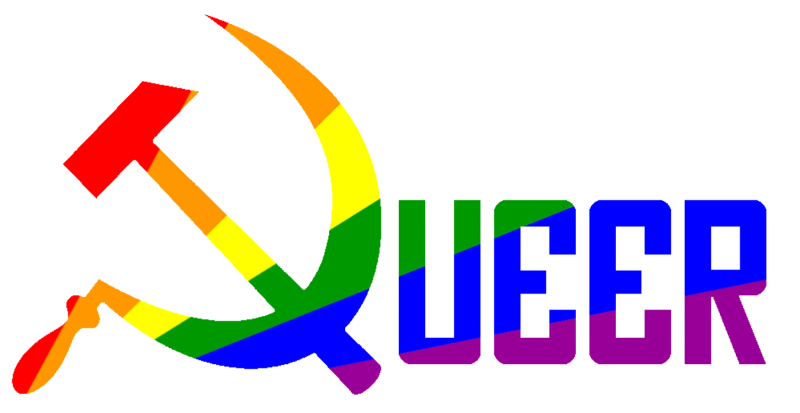

<h2 align="left">hi my name is  ❄ ❄ ❄ ❄  and i'm a fullstack developer (i think), from ....ah who the fuck cares ❄ ❄ ❄ ❄ </h2>

###

Hark, I shall declare with solemn conviction: Rust is the tongue in which I choose to commit my coding misdeeds. Nay, not merely a language, but our sacred religion—our new glorious savior of syntax and 
performance.

For the frontend, Rust shall be my companion; for the backend, Rust shall guide me. And as for that trifling matter of aesthetics, wherein beauty must be wrought, I shall adhere to the divine principles 
of CSS.

Blessed are those who follow its strictures! For in my view, the very existence of Tailwind is but an abomination—a sad testament to the mass accumulation of skill deficits and a betrayal of true 
craftsmanship. Let us raise our voices in unison: LONG LIVE PURE CSS!

But let us not deceive ourselves; for though I may espouse these ideals, my days are spent as a small cog in the great machine, churning out lines of C# within the cold, sterile confines of cubicles.
A humble part of an assembly line, where creativity is but a distant whisper, and innovation a forgotten relic.

Yet, amidst this humdrum existence, I hold fast to hope. For what we can do as united human forces is look forward—to forge the path toward our promised land, using Rust as our guiding star.
Together, we shall tread the way to that radiant horizon where "Fully Automated Luxury Gay Space Communism" awaits—our utopia, built upon the principles of purity and performance.

  <!--  -->
  

###

First they came for the Communists
And I did not speak out
Because I was not a Communist
Then they came for the Socialists
And I did not speak out
Because I was not a Socialist
Then they came for the trade unionists
And I did not speak out
Because I was not a trade unionist
Then they came for the Jews
And I did not speak out
Because I was not a Jew
Then they came for me
And there was no one left
To speak out for me

- Martin Niemöller

  
  <!---->
<!--  
     -->
<!--  -->
<!--  -->
<!--  -->
<!--  -->
<!---->
<!-- -->

 
